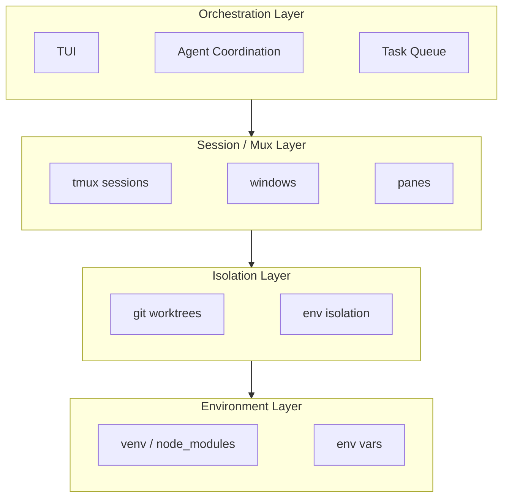
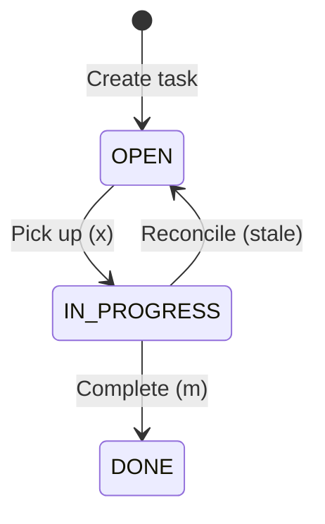

# Architecture

Bouquet is an orchestration layer for multi-agent coding that composes four concerns.

## The Stack

```
CLI (Click) → bouquet start/stop/init
  └─► WorktreeManager (worktree.py — glue layer)
       ├─► git.py         subprocess calls for worktree CRUD
       ├─► tmux.py        libtmux wrapper for session/window/pane lifecycle
       ├─► template.py    safe {{ expr }} rendering for service commands
       ├─► bootstrap.py   setup_commands → deps install → post_deps_commands; env capture, env file copy, CoW clone; teardown_commands on remove
       ├─► activity.py    ActivityMonitor — pane scraping for live status
       ├─► github.py      gh CLI wrapper for PR URL lookup
       ├─► tasks/         pluggable task queue (LocalBackend, GitHubIssuesBackend)
       └─► TUI (tui/app.py — Textual app in tmux window 0)
            └─► spawns worktree windows via WorktreeManager
```

## Conceptual Layers



## Key Flow

`bouquet start` creates a tmux session, launches the TUI in window 0, then the TUI drives `WorktreeManager.create()` which chains:

1. **Git worktree creation** — new branch + worktree directory
2. **Bootstrap** — `setup_commands` (env capture), env file copy, CoW clone, `python_deps_command` / `node_deps_command`, `post_deps_commands` (env capture), `direnv allow`
3. **Tmux window** — new window with agent pane + service panes (env from setup + post_deps propagated via `set_environment`)
4. **Agent launch** — `send_keys` to the agent pane

`WorktreeManager.remove()` runs `teardown_commands` first (best-effort, so user code can still reach the on-disk checkout) and then kills the tmux window and removes the git worktree.

## Activity Detection

The `ActivityMonitor` polls each agent's tmux pane every 2 seconds:

- **SHA256 hash** of pane content; hash change → RUNNING
- **Stable 3+ polls** → IDLE (or WAITING if a permission prompt is detected)
- **Prompt detection** scans the last 10 lines for permission menus

## Task Queue

Pluggable backend system with two implementations:

| Backend | Storage | Status Mapping |
|---------|---------|----------------|
| **Local** | SQLite (`~/.local/state/bouquet/<project>.tasks.db`) | Direct status field |
| **GitHub Issues** | GitHub Issues via `gh` CLI | OPEN = open issue, IN_PROGRESS = `in-progress` label, DONE = closed |

### Task Lifecycle



## Pane Layouts

### `services-top` (default)

```
┌────────────┬────────────┐
│   api      │  frontend  │  ← services (~40%)
├────────────┴────────────┤
│       agent (claude)    │  ← agent (~60%)
└─────────────────────────┘
```

### `main-vertical`

```
┌──────────────────┬────────────┐
│                  │   api      │
│   agent (claude) ├────────────┤
│                  │  frontend  │
└──────────────────┴────────────┘
```
